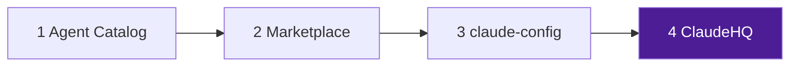

<div align="center">

# ClaudeHQ

### **Workspace hub** for the [**Claude Code**](https://claude.ai/claude-code) ecosystem

[](https://github.com/SkyWalker2506/ClaudeHQ#ecosystem-github-order)
[](https://github.com/SkyWalker2506/claude-config)
[](https://linkedin.com/in/musab-kara-85580612a)

**You are here — step 4 ·** Open this repo in Claude Code to orchestrate **all** projects under one session.

[Quick start](#quick-start) · [Ecosystem](#ecosystem-github-order) · [HQ CLI](#project-management)

</div>

---

On GitHub, start the tour at the **[agent catalog](https://github.com/SkyWalker2506/claude-agent-catalog)** → **[marketplace](https://github.com/SkyWalker2506/claude-marketplace)** → **[claude-config](https://github.com/SkyWalker2506/claude-config)** → **ClaudeHQ (this repo)**.



---

## Quick Start

```bash
# Clone and install the ecosystem foundation
git clone https://github.com/SkyWalker2506/claude-config.git ~/Projects/claude-config
cd ~/Projects/claude-config && ./install.sh
```

That's it. `install.sh` sets up CLAUDE.md redirectors, MCP servers, skills, and agent registry across all your projects.

---

## Ecosystem (GitHub order)

| Step | Repository | Description | Link |
|------|------------|-------------|------|
| **1** | **claude-agent-catalog** | Agent inventory — start here on GitHub | [repo](https://github.com/SkyWalker2506/claude-agent-catalog) |
| **2** | **claude-marketplace** | Plugin marketplace — browse & install | [repo](https://github.com/SkyWalker2506/claude-marketplace) |
| **3** | **claude-config** | Multi-Agent OS — rules, skills, agents, MCP, `install.sh` | [repo](https://github.com/SkyWalker2506/claude-config) |
| **4** | **ClaudeHQ** | This repo — cross-project workspace | [repo](https://github.com/SkyWalker2506/ClaudeHQ) |
| — | **ccplugin-*** | Individual plugin repos | [search](https://github.com/SkyWalker2506?tab=repositories&q=ccplugin) |

---

## Projects

Managed projects in the ecosystem:

| Project | Jira | Description |
|---------|------|-------------|
| ar-research | — | AR research & prototyping |
| ByteCraftHQ | — | ByteCraft studio HQ |
| Viralyze | — | Social media analytics |
| VocabLearningApp | VOC | Vocabulary learning app |
| football-ai-platform | — | Football AI / Tartismali Pozisyonlar |
| KnightOnlineAI | — | Knight Online AI bot |
| ProjeBirlik | — | Community project platform |
| trading-bot | — | Trading automation |
| transcriptr | — | Transcription tool |

---

## New Project

Set up a new project with the full Claude ecosystem:

```bash
# 1. Create the project
mkdir ~/Projects/my-new-project && cd ~/Projects/my-new-project
git init

# 2. Install claude-config
cd ~/Projects/claude-config && ./install.sh

# 3. (Optional) Add to projects.json in ClaudeHQ
# 4. (Optional) Create Jira project and link
```

The installer handles CLAUDE.md, .claudeignore, MCP configuration, and skill registration.

---

## HQ Usage

Open ClaudeHQ in Claude Code to work across projects:

```bash
cd ~/Projects/ClaudeHQ
claude
```

From here you can:

- **Cross-project tasks** — "Update the README in all projects"
- **Ecosystem management** — "Show me all plugin statuses"
- **New project setup** — "Create a new project called X"
- **Jira overview** — "What's in progress across all projects?"
- **Agent dispatch** — Route tasks to the right agent in any project

ClaudeHQ reads `projects.json` to know which projects exist and where they live. This file is auto-generated by `hq scan` and local-only (gitignored).

---

## Project Management

ClaudeHQ includes a CLI tool (`scripts/hq`) for managing sprints, dispatching Claude sessions, and monitoring progress across all projects.

### Quick Start

```bash
# 1. Discover all projects (scans ~/Projects for CLAUDE.md)
./scripts/hq scan

# 2. Initialize a sprint for a project
./scripts/hq sprint init VocabLearningApp
# Edit sprints/VocabLearningApp/sprint-1.json to define tasks

# 3. Launch a Claude session for a project
./scripts/hq session VocabLearningApp

# 4. Launch sessions for ALL active projects at once
./scripts/hq session --all

# 5. Monitor progress
./scripts/hq status              # Dashboard view
./scripts/hq monitor --watch     # Live monitoring

# 6. Check for stuck projects
./scripts/hq stuck
```

### Commands

| Command | Description |
|---------|-------------|
| `hq scan` | Scan ~/Projects for CLAUDE.md projects, generate projects.json |
| `hq new <name> [--jira KEY]` | Create a new project with full ecosystem setup |
| `hq session <project\|--all>` | Launch Claude session(s) in background |
| `hq dispatch <project\|--all>` | Deprecated alias for `hq session` |
| `hq status [project]` | Show project status dashboard |
| `hq sprint plan <project>` | Launch AI-powered sprint planning |
| `hq sprint list [project]` | List all sprints |
| `hq sprint init <project>` | Initialize sprint tracking |
| `hq monitor [--watch]` | Monitor running sessions |
| `hq stuck` | Show stuck/blocked projects |
| `hq archive <project>` | Deactivate a project |
| `hq activate <project>` | Reactivate a project |
| `hq config [project]` | Show project configuration |
| `hq logs <project>` | Show session logs |
| `hq sync [--dry-run]` | Sync ecosystem stats to all downstream README pages |

### How It Works

1. **Scan** discovers projects by finding `CLAUDE.md` files in `~/Projects`
2. **Sprints** define tasks with prompts that Claude will execute
3. **Dispatch** launches `claude -p` sessions in the background for each project
4. **Progress** is tracked in JSON files that sessions write to
5. **Monitor** watches PIDs and timestamps to detect stuck sessions

---

## Architecture

```
ClaudeHQ (you are here)
  |
  +-- claude-config/        # Rules, skills, agents, plugins
  |     +-- install.sh      # Ecosystem installer
  |     +-- global/skills/  # Shared skills
  |     +-- agents/         # 134 agent definitions
  |     +-- config/         # Agent registry, model tiers, fallback chains
  |
  +-- claude-marketplace/   # Plugin discovery & distribution
  +-- ccplugin-*/           # Individual plugins
  +-- [your projects]/      # All managed projects
```

---

## Ecosystem

| Repo | Description |
|------|-------------|
| [claude-config](https://github.com/SkyWalker2506/claude-config) | Multi-Agent OS — 139 agents, local-first routing, cost-aware orchestration |
| [claude-marketplace](https://github.com/SkyWalker2506/claude-marketplace) | Claude Code Plugin Marketplace — 21 plugins, one-command install |
| [claude-agent-catalog](https://github.com/SkyWalker2506/claude-agent-catalog) | Agent catalog — 139 agents across 15 categories |
| [sdk-market](https://github.com/SkyWalker2506/sdk-market) | SDK Market — production-ready kits for Flutter and beyond |

---

*Built with Claude Code by Musab Kara*
